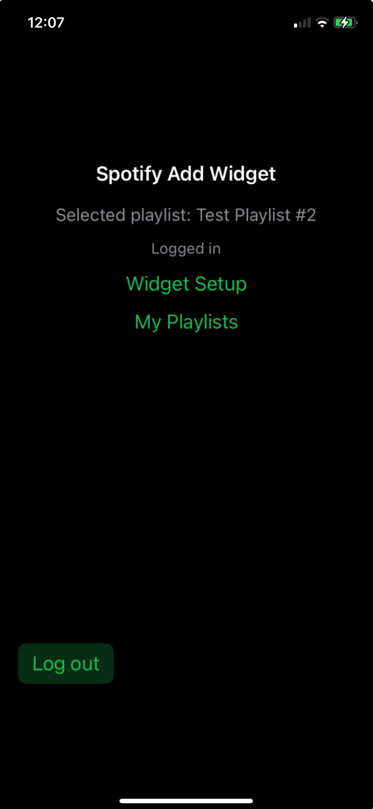

# Spotify Add Widget
## Never Miss a Great Song Again! 🎵

  

### ⚡ Instant Song Saving
Save any currently playing song to your Spotify playlists **instantly** - right from your lock screen.

## 📱 Screenshots

### Main App Interface

  
  
<em>Clean, simple interface</em>

### Select Your Playlist

  
  
<em>Choose from your Spotify playlists</em>

### Lock Screen Widget

  
  
<em>Add songs without unlocking your phone</em>

## 🚀 How It Works

  

    
    
<strong>1. Setup</strong> Login and select playlist

  

  

    
    
<strong>2. Add Widget</strong> Place on lock screen

  

  

    
    
<strong>3. Save Songs</strong> Tap the + button

  

